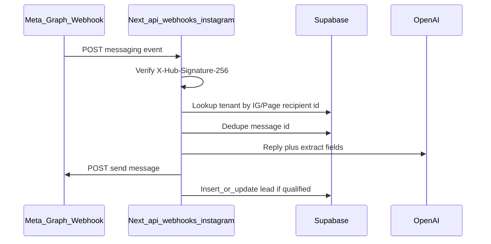

# Instagram DM AI lead bot (full integration)

## Phased delivery

- **Phase 1 — Foundation + DM MVP**: `saas_meta_platform_config`, `getMetaPlatformCredentials`, SaaS Admin Meta UI; `instagram_dm_leads` marketplace + entitlement; DB: connections + dedupe + minimal activity/config; webhook **messaging only**; OAuth; LLM + `leads`; tenant **Overview** + **Setup** + dashboard card.
- **Phase 2 — Automations + comments + analytics**: Keywords, schedule, `media_targets`, comment webhook + allowlist, `GET .../media`; **Automations** + **Analytics** UI; Realtime; multi-channel activity.
- **Phase 3 — Advanced + polish**: `checkSenderFollowsBusinessAccount`, `require_follower`, Conditions UI, follower analytics; optional rollups/cron; hardening + docs.

Todos map loosely: **Phase 1** — `saas-meta-credentials`, `marketplace-plugin`, `entitlement`, `db-migration` (minimal), `webhook-api` (DM-only slice), `oauth-routes`, `ai-pipeline` (basic), `admin-nav-pages` (Overview/Setup), `env-docs` (partial). **Phase 2** — full `db-migration`, `instagram-media-api`, `webhook-api` (comments+keywords), `realtime-analytics-ui`. **Phase 3** — follower/conditions extension on webhook + `ai-pipeline`, remaining `env-docs`. **Each phase**: run **cross-check** + expand `**phase-qa-testing`** (automated).

## Phase completion: cross-check & automated testing

- **Manual cross-check** per phase before release: security (no secret leaks), webhook signature, entitlement, OAuth, RLS, Phase 2 media/keywords/schedule, Phase 3 follower branches.
- **Automated**: unit tests (matchers, schedule, signature verify), integration tests (mocked Graph/OpenAI/Supabase), JSON **fixtures** for Meta payloads, **CI required** on PRs touching these routes; optional **Playwright** smoke for admin Install → Setup.

## Multi-channel automations, keywords, and scheduling

### Keyword automation setup

- **Rules** per channel: match type (`contains` / `whole_word` / `exact`), case, **action** (`ai_reply`, `template_reply`, `send_link`, `suppress`, etc.), priority order.
- **Blocklist** optional — skip or moderate when matched.
- **Webhook**: text normalize → **keyword pass** → then default AI if no rule.
- **UI**: Keywords tab under Automations; optional `instagram_automation_keyword_rules` table.

### Conditional automation & follower check (advanced)

- `**require_follower`** on rules with `send_link` — Graph API **follower check** before sending URL; else `**else_message`** (CTA to follow).
- **Helper** `checkSenderFollowsBusinessAccount` + short TTL cache; **unknown** → safe fallback (no link).
- **Extensible** `conditions` jsonb on rules; analytics: `link_sent_follower` vs `blocked_not_following`.
- **Risk**: Meta API surface varies; may be **beta** until verified.

### Channels

- **DM automation** — messaging webhook; AI + leads (`instagram_dm`).
- **Comment automation** — comment webhooks; **only for IG media the tenant selected** — **Feed posts** and/or **Reels** via `**instagram_automation_media_targets`** (`ig_media_id` + `FEED` / `REELS`); sync list from Graph `**/{ig-user-id}/media`** for admin picker.
- **Story automation** — story reply + mentions per docs; `channel: story`.
- **Post & Reel selection** — Automations UI: **multi-select** synced posts/reels; webhook compares `comment.media.id` to allowlist (optional **global** mode).
- **Scheduling** — timezone, windows, quiet hours; evaluate before send.
- **Phasing**: See **Phased delivery** table above (Phase 1 DM → Phase 2 full automations → Phase 3 advanced).

## Platform SaaS Admin — Meta / Facebook / Instagram API (DB + UI)

- **Purpose**: One Meta app for all tenants — **App ID**, **App Secret** (encrypted), **webhook verify token**, **Graph API version**, OAuth redirect — stored in `**saas_meta_platform_config`** (migration) or `**saas_platform_settings`** key-value ([existing pattern](src/spa-pages/saas-admin/SaasAdminSettings.tsx)).
- **UI**: `[SaasAdminSettings.tsx](src/spa-pages/saas-admin/SaasAdminSettings.tsx)` new card or `/saas-admin/...` page; `[SaasAdminSidebar.tsx](src/components/saas-admin/SaasAdminSidebar.tsx)` link if separate; **masked secret**; **super_admin** only.
- **Server**: `getMetaPlatformCredentials()` — **DB first**, **env fallback** (`META_APP_ID`, …); webhook + OAuth use helper.
- **Security**: Save secrets via server route; RLS; optional `META_CREDENTIALS_ENCRYPTION_KEY`.

## Marketplace — paid plugin

- Ship as `**plugin_key: instagram_dm_leads`** in `[src/lib/marketplace-manifest.ts](src/lib/marketplace-manifest.ts)` (extend `REGISTERED_PLUGIN_KEYS`, Zod branch, `defaultPluginSettings`, `[MarketplacePluginBuilderPanel](src/components/saas-admin/MarketplacePluginBuilderPanel.tsx)`, `[ai-suggest` prompt](src/app/api/saas-admin/marketplace/ai-suggest/route.ts)).
- **Catalog**: SaaS Admin creates a **paid** `[marketplace_items](src/integrations/supabase/types.ts)` row (`one_time` or `recurring`); tenants use existing `[AdminMarketplace](src/spa-pages/admin/AdminMarketplace.tsx)` **Pay & install** → `[verify-payment](src/app/api/marketplace/verify-payment/route.ts)` → `[tenant_marketplace_installs](src/integrations/supabase/types.ts)`.
- **Entitlement**: Before OAuth or DM handling, verify install for manifest `instagram_dm_leads`, `status === installed`, and if recurring validate `config.marketplace.paid_until` (same pattern as verify-payment).
- **Admin UX**: **Automations** includes **Keywords** + **Posts & Reels** picker. Sidebar: Overview, Automations, Analytics, Setup.

## Per-tenant Instagram connection

- **Each tenant connects their own Instagram** (Business/Creator + linked Facebook Page). Store one `tenant_instagram_connections` row per tenant (their Page token + Instagram Business Account ID).
- Tenant **admin** runs **Connect with Facebook** in **their** admin UI only; OAuth `state` binds the token to that `tenant_id`.
- **One webhook URL** for the Meta app; routing is by **recipient Instagram business id** on each event, not by subdomain.
- **Disconnect** is per-tenant and does not affect other tenants.

## Context

- **Existing pieces to reuse**: `[src/integrations/supabase/service-role.ts](src/integrations/supabase/service-role.ts)` for server-side DB; `[leads](src/integrations/supabase/types.ts)` table (`source`, `meta` JSON, `full_name`, `phone`, `message`); tenant `[ai_settings](src/integrations/supabase/types.ts)` (`system_prompt`, `ai_model`, toggles) for personality-aligned replies.
- **Gaps**: No Meta/Instagram webhook, no OAuth for Page tokens, no DM send path. AI today is partly Edge (`ai-search` invoke from `[StickyBottomNav.tsx](src/components/StickyBottomNav.tsx)`) — the DM bot should use a **dedicated Next.js API route** with `OPENAI_API_KEY` (or your existing OpenAI pattern from `[src/app/api/saas-admin/marketplace/ai-suggest/route.ts](src/app/api/saas-admin/marketplace/ai-suggest/route.ts)`) so webhook handling stays in-repo and testable.

## Architecture (high level)

## 1. Meta Developer / product setup (manual, documented)

- Meta app with Instagram: **Messaging** + webhook fields for **comments** / IG **changes** as needed for comment automation; story events per current docs.
- Webhook URL shared for all tenants; subscribe to `messages` + required fields for comments/story-related events.
- Permissions for messaging, comment management, pages — **App Review**; comply with automation policies.
- Document in a short ops file (only if you want it in-repo): App ID, redirect URIs, required permissions, and that **Instagram account must be Business/Creator** and **linked to a Facebook Page**.

## 2. Database (new migration)

Add tables (names illustrative; keep consistent with your naming):

- `**tenant_instagram_connections`**: `tenant_id` (PK/FK), `facebook_page_id`, `instagram_business_account_id` (recipient id used in webhooks), encrypted or server-only `page_access_token`, `token_expires_at`, `created_at`, `updated_at`. RLS: tenant read via membership; **writes from webhook use service role only**.
- `**instagram_webhook_events`**: `message_mid` (unique) for **idempotency**.
- `**instagram_channel_activity`**: `tenant_id`, `**channel`** (dm|comment|story), `event_type`, timestamps, `meta` jsonb — analytics + Realtime.
- `**instagram_automation_config`**: `settings` jsonb — `**keyword_rules`**, blocklist, per-channel rules + **schedule**.
- `**instagram_automation_schedules`**: optional normalized schedule rows if not embedded.
- `**instagram_automation_media_targets`**: selected **Posts** / **Reels** (`ig_media_id`, `media_product_type`) for scoped comment automation.
- Optional: `**instagram_dm_sessions`** for conversation memory.
- **Supabase Realtime**: `instagram_channel_activity`, config, `leads` — strict RLS.

Regenerate types: `[src/integrations/supabase/types.ts](src/integrations/supabase/types.ts)` and `[mobile/lib/database.types.ts](mobile/lib/database.types.ts)` after migration.

## 3. Next.js API routes (server-only)

| Route                                      | Role                                                                                                                                                                                             |
| ------------------------------------------ | ------------------------------------------------------------------------------------------------------------------------------------------------------------------------------------------------ |
| `GET /api/webhooks/instagram`              | Meta **subscription verification** (`hub.mode`, `hub.verify_token`, `hub.challenge`). Compare `verify_token` to `META_WEBHOOK_VERIFY_TOKEN` (global) or a value stored per tenant if you prefer. |
| `POST /api/webhooks/instagram`             | Verify signature; media allowlist → **keyword rules** → schedule → dedupe → template or AI → Graph → `leads` + activity.                                                                         |
| `GET /api/integrations/instagram/media`    | Entitled tenant admin: Graph list **Posts/Reels** for picker UI.                                                                                                                                 |
| `GET /api/integrations/instagram/auth`     | **403 if not entitled**; tenant admin session; Meta OAuth `state` → `tenant_id`.                                                                                                                 |
| `GET /api/integrations/instagram/callback` | Entitlement check; exchange code; store tokens in `tenant_instagram_connections`.                                                                                                                |

**Sending DMs**: Use Graph API `POST /{page-id}/messages` with the stored page access token (see current Meta “Instagram Messaging API” docs for exact path/version).

**Secrets**: Prefer encrypting `page_access_token` at rest (e.g. libsodium/`crypto` with a server env `INSTAGRAM_TOKEN_ENCRYPTION_KEY`) — do not store plaintext tokens in client-readable columns.

## 4. AI behavior

- **System prompt**: Merge `ai_settings` with `**instagram_automation_config`** per `**channel`**; respect **schedule** (quiet hours / weekly windows).
- **Model**: `gpt-4o-mini` or `INSTAGRAM_DM_MODEL` env; channel-safe tone for **public comments**.
- **Output**: Keyword **template** path skips LLM; else DM qualification JSON + leads per channel sources.

## 5. Admin UI — automations, deep analytics, real-time

- **Purchase path**: `[AdminMarketplace](src/spa-pages/admin/AdminMarketplace.tsx)`.
- **Post-install**: Collapsible **Instagram Bot** in `[AdminSidebar.tsx](src/components/admin/AdminSidebar.tsx)`:
  - **Overview** — live KPIs + feed by channel (**Realtime** on `instagram_channel_activity`).
  - **Automations** — **Keywords** + Post/Reel + DM/comment/story + **schedule**.
  - **Analytics** — metrics **by channel**; Realtime inserts.
  - **Setup** — `/admin/instagram-bot/setup` — OAuth, webhook URL, connection health (**Realtime** on connection row).
- **Main dashboard**: `[AdminDashboard.tsx](src/spa-pages/admin/AdminDashboard.tsx)` — compact **live** Instagram metrics card.
- **Routes**: `instagram-bot/page.tsx`, `automations/page.tsx`, `analytics/page.tsx`, `setup/page.tsx`; `[AdminLayout.tsx](src/components/admin/AdminLayout.tsx)` titles.
- Only **that tenant’s** admins (same pattern as other admin APIs).

## 6. Environment variables

- `META_APP_ID`, `META_APP_SECRET`, `META_WEBHOOK_VERIFY_TOKEN`
- `INSTAGRAM_OAUTH_REDIRECT_URI` (must match Meta app settings)
- `OPENAI_API_KEY` (or reuse existing) + optional `INSTAGRAM_DM_MODEL`
- `INSTAGRAM_TOKEN_ENCRYPTION_KEY` (if encrypting tokens)
- Existing `SUPABASE_SERVICE_ROLE_KEY` + Supabase URL for webhook DB access

## 7. Testing and rollout

- Use **Meta’s test users / development mode** and [webhook test tool](https://developers.facebook.com/) before production.
- Log structured errors (signature fail, unknown recipient, send API errors) without leaking tokens.
- Rate-limit LLM + outbound sends per tenant if needed (reuse `[src/lib/rate-limit-memory.ts](src/lib/rate-limit-memory.ts)` pattern).

## Risk / scope notes

- **App Review** for messaging + comments + advanced Instagram features; phased rollout acceptable.
- **Webhook URL must be HTTPS**; multi-tenant routing by stored IG/Page ids.
- **Comment/story** behavior depends on Meta API surface — may follow DM MVP.

