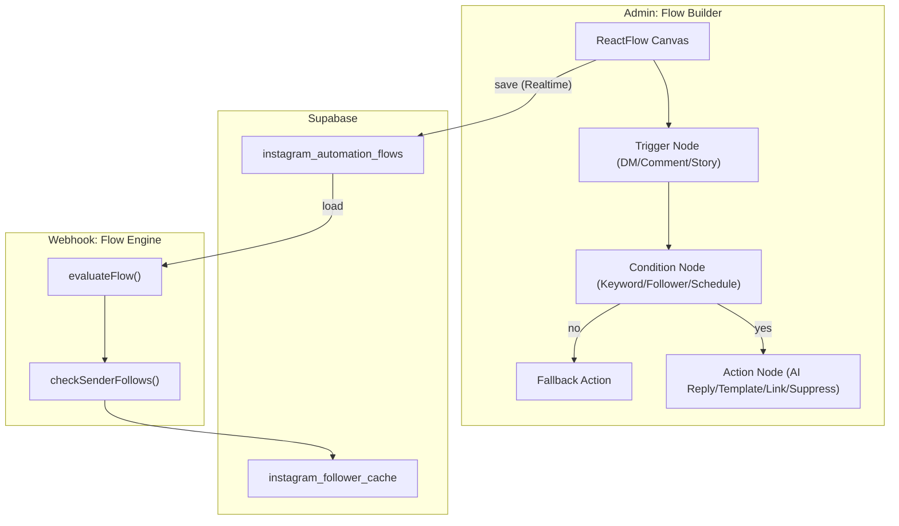

# Advanced Flow Builder + Follower Conditions

## Current state

The Instagram bot currently uses **flat keyword rules** in `instagram_automation_keyword_rules` and inline jsonb in `instagram_automation_config.settings.keyword_rules`. The webhook handler in `[src/app/api/webhooks/instagram/route.ts](src/app/api/webhooks/instagram/route.ts)` evaluates rules with a simple priority-ordered loop. The follower-check helper in `[src/lib/instagram-follower.ts](src/lib/instagram-follower.ts)` exists but is **not wired** into the webhook or UI — it always returns `null` because the Graph API endpoint is unreliable.

The Automations page in `[src/spa-pages/admin/InstagramBotAutomations.tsx](src/spa-pages/admin/InstagramBotAutomations.tsx)` is a tabbed list (Keywords, Posts & Reels, Schedule) with no visual flow or conditions editor.

## Architecture

## Phase 1 — Flow Builder Foundation + DB

**Goal:** Tenants can visually build automation flows with trigger and action nodes; flows save to DB and sync in real-time.

**DB migration** `supabase/migrations/20260323150000_instagram_flows.sql`:

- New table `instagram_automation_flows`: `id`, `tenant_id` (FK tenants), `name`, `channel` (`dm`/`comment`/`story`/`all`), `flow_definition` (jsonb — `{ nodes: [...], edges: [...] }`), `enabled`, `is_draft`, `version`, `created_at`, `updated_at`. Unique on `(tenant_id, name)`.
- RLS: tenant read/write own + service_role all.
- Realtime publication.

**Dependencies:** Install `@xyflow/react` (the maintained successor to reactflow).

**Files to create:**

- `src/components/admin/instagram-bot/FlowBuilder.tsx` — React Flow canvas with custom node types, sidebar node palette, save/load.
- `src/components/admin/instagram-bot/nodes/TriggerNode.tsx` — Trigger: DM, Comment, Story (start of flow).
- `src/components/admin/instagram-bot/nodes/ActionNode.tsx` — AI Reply, Template Reply, Send Link, Suppress, Qualify Lead.
- `src/components/admin/instagram-bot/nodes/ConditionNode.tsx` — Stub (populated in Phase 2).
- `src/lib/flow-engine.ts` — `evaluateFlow(flowDef, context)` that walks the graph at runtime, returns the resolved action.

**Files to modify:**

- `[src/spa-pages/admin/InstagramBotAutomations.tsx](src/spa-pages/admin/InstagramBotAutomations.tsx)` — add a "Flow Builder" tab alongside the existing Keywords/Media/Schedule tabs.
- `[src/app/api/webhooks/instagram/route.ts](src/app/api/webhooks/instagram/route.ts)` — `handleMessaging` and `handleChange` load flows from `instagram_automation_flows` and call `evaluateFlow()` before falling back to flat keyword rules.

**Phase gate:** Migration via `supabase db push`, types regen, tests for `evaluateFlow()` (trigger -> action path), Git commit + tag `instagram-flow-builder-phase-1`.

---

## Phase 2 — Conditions + Follower Gate (the core ask)

**Goal:** Condition nodes with branching ("yes" / "no" edges): Keyword Match, **Follower Check** (follow to get link), Schedule Window. The `send_link` action only fires if the sender follows the account.

**DB migration** `supabase/migrations/20260323160000_instagram_flow_conditions.sql`:

- Add `conditions_meta` jsonb column to `instagram_automation_flows` for default condition settings (e.g., `else_message`).
- No new tables needed — `instagram_follower_cache` already exists.

**Files to create/modify:**

- `src/components/admin/instagram-bot/nodes/ConditionNode.tsx` — fully built: **Keyword Match** (match text, type, case), **Follower Check** (toggle + `else_message` text field), **Schedule Window** (timezone, days, hours).
- `src/components/admin/instagram-bot/FlowBuilder.tsx` — condition nodes have two output handles ("Yes" / "No"); edges render with labels.
- `src/lib/flow-engine.ts` — extend `evaluateFlow()` to handle condition branching: load keyword rules, call `checkSenderFollowsBusinessAccount()`, evaluate schedule.
- `[src/lib/instagram-follower.ts](src/lib/instagram-follower.ts)` — improve: attempt the `/{ig-user-id}/followers` edge or `business_discovery` username lookup; if API unavailable, policy = **fail closed** (block link, send else_message). Cache result.
- `[src/app/api/webhooks/instagram/route.ts](src/app/api/webhooks/instagram/route.ts)` — pass `conn` and `creds` to `evaluateFlow()` so it can call the follower check; log `follower_check` result in `instagram_channel_activity.meta`.

**Follower-gate flow example:**

- Trigger: DM -> Condition: Keyword "link" -> Condition: Follower Check -> **Yes**: Send Link -> **No**: Template "Follow @brand and message again to get the link"

**Phase gate:** Migration, types, tests for condition branching + follower check mock, Git commit + tag `instagram-flow-builder-phase-2`.

---

## Phase 3 — Polish, Analytics, Advanced Conditions

**Goal:** Multiple flows per channel, draft/publish, flow-level analytics, advanced conditions (first_message_only, min_account_age), UI polish.

**DB migration** `supabase/migrations/20260323170000_instagram_flow_analytics.sql`:

- `instagram_flow_executions` table: `id`, `tenant_id`, `flow_id`, `node_id`, `event_type`, `sender_ig_id`, `result`, `created_at` — per-node execution log for funnel analytics.
- `follower_check` values populated: `follower`, `not_following`, `unknown`.

**Files to create/modify:**

- `src/components/admin/instagram-bot/FlowAnalytics.tsx` — per-node execution counts overlaid on the canvas (heatmap badges on nodes).
- `src/components/admin/instagram-bot/nodes/ConditionNode.tsx` — add "First Message Only" and future condition types.
- `src/spa-pages/admin/InstagramBotAutomations.tsx` — flow list (multiple flows), enable/disable, draft indicator.
- `src/lib/flow-engine.ts` — log executions to `instagram_flow_executions`; analytics helpers.
- `[src/spa-pages/admin/InstagramBotAnalytics.tsx](src/spa-pages/admin/InstagramBotAnalytics.tsx)` — add "Flow Funnels" section: `link_sent_follower` vs `blocked_not_following` breakdown.

**Phase gate:** Migration, types, tests for analytics logging + multi-flow selection, Git commit + tag `instagram-flow-builder-phase-3`.

---

## Per-phase ops (same as prior feature)

- **DB**: Timestamped migration in `supabase/migrations/`; `supabase db push`; `npx supabase gen types typescript --linked` into `[src/integrations/supabase/types.ts](src/integrations/supabase/types.ts)` + `[mobile/lib/database.types.ts](mobile/lib/database.types.ts)`.
- **Tests**: Vitest tests under `__tests__/lib/flow-engine.test.ts` (+ condition/follower mocks). Run `npm test` before commit.
- **Git**: Commit with message referencing phase; push; tag (e.g., `instagram-flow-builder-phase-N`).

