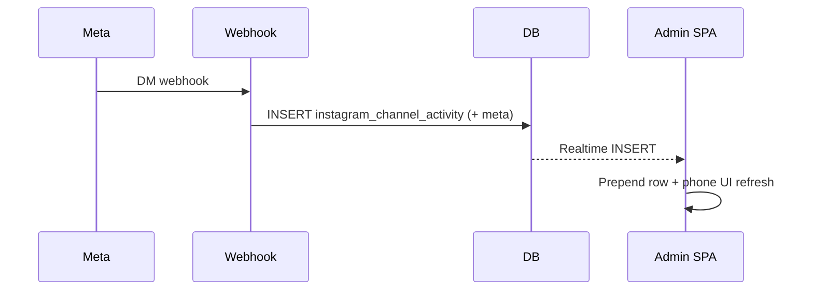

# Live DM preview — phone emulator + real-time

## User goals

- **See how messages look** as they arrive: a **phone emulator** (device frame) with a **real-time** preview inside.
- **Real-time**: list updates as soon as new data is available over the wire (Supabase Realtime on `instagram_channel_activity`).
- **Templates**: a **modal** (“Templates”) with a **two-column grid** of preset cards (matching the reference: titles, short descriptions, badges **Instant** / **AI** / **BETA** / **SOON**, dimmed **SOON** items), plus a **footer** row for **Flow Builder** (“Build Your Flow, Your Way” with premium/SOON cues). **Close (X)** in header.
- **Automation Editor (reference: Zorcha-style)**: A dedicated **editor** view where the **center column** is a phone emulator titled **“Preview Automation”** that updates **live as the user edits** the right-hand configuration (not dependent on production webhooks). The **right column** uses **stepped sections**, e.g. **(1) Select a Post or Reel** (any vs specific / “next post”), **(2) Setup Keywords** (any keyword vs list), **(3) Send a DM** (image upload, message text with limit, **Add Link**, quick-reply button label). The preview shows **bot messages**, **tap-to-simulate user** (e.g. “Send me the link”), **image bubbles**, and placeholder when fields are empty—**WYSIWYG from React state**, optionally persisted to `instagram_automation_config` / flows later.

## Architecture (unchanged core)

## 1. Persist inbound text (required)

- In [`src/app/api/webhooks/instagram/route.ts`](src/app/api/webhooks/instagram/route.ts) `handleMessaging`, add `inbound_text: message.text.slice(0, 500)` (or 1000) into `meta` for every DM activity insert so the admin can render the user’s message in the emulator.

## 2. Phone emulator UI (required)

- In [`src/spa-pages/admin/InstagramBotOverview.tsx`](src/spa-pages/admin/InstagramBotOverview.tsx) (or a small child component e.g. `InstagramDmPhonePreview.tsx` under `src/components/admin/instagram-bot/`):
  - **Outer shell**: fixed aspect ratio phone frame (e.g. `max-w-[280px]`–`320px`), rounded corners, border/shadow, optional **notch** or top bar; **dark “Instagram DM”**-style header strip (title: “Messages” / `@ig_username` from connection if we pass it or from tenant).
  - **Inner**: scrollable column of **incoming bubbles** (left-aligned, muted background), newest at bottom (like chat apps). Show: inbound text snippet, `sender_ig_id` truncated, time, optional `event_type` / LEAD pill.
  - **Empty state**: placeholder text inside the phone (“No DMs yet…”).
  - Match existing admin design tokens (`Card`, `text-muted-foreground`, etc.).

## 3. Real-time behavior (required)

- Keep tenant-scoped `postgres_changes` on `instagram_channel_activity` (INSERT, `tenant_id=eq.${tid}`).
- On INSERT for `channel === 'dm'`:
  - **prepend or append** the new row to local DM thread state immediately (so the phone updates **without waiting** for full `loadOverview` refetch).
  - Keep debounced `loadOverview` for KPI **stats** (or merge counts incrementally if you want to avoid extra queries).
- Cap thread length (e.g. last 30–50 DM rows) to avoid heavy DOM.

## 4. Timing honesty (product + optional phase)

- **Today:** one activity row is written **after** the bot finishes handling (reply/suppress). Realtime is **live** when that row appears, but **not** the moment Meta hits the server.
- **Optional UX upgrade:** insert a **`message_received`** (or `processing`) row **immediately after dedupe** with `meta.inbound_text` only, then **either**:
  - **A)** Second insert when done (`message_replied`) — requires KPI/analytics rules to count **distinct `mid`** or only “final” event types so totals don’t double; or
  - **B)** **Update** the same row (not append-only) — conflicts with append-only analytics policy unless we allow UPDATE for that row only.

**Recommendation for plan:** implement **single-row + meta.inbound_text** first + phone UI + Realtime; add **early `message_received` insert** as a follow-up if you want sub-second “arrival” in the emulator.

## 5. Docs

- One short section in [`docs/instagram-dm-ai-bot.md`](docs/instagram-dm-ai-bot.md): emulator shows `meta.inbound_text`; when the row is written (after handling vs optional early row).

## 6. Templates modal (reference UI)

- **Component**: `Dialog` from shadcn ([`src/components/ui/dialog.tsx`](src/components/ui/dialog.tsx)), e.g. `InstagramBotTemplatesDialog.tsx` under [`src/components/admin/instagram-bot/`](src/components/admin/instagram-bot/).
- **Layout**:
  - Header: title **Templates**, dismiss **X** (DialogClose).
  - Body: responsive **grid** (`grid-cols-1 sm:grid-cols-2`), gap, cards with **rounded** borders and padding.
  - **Cards** (copy from reference):
    1. **Answer all your FAQs** — badges: Instant, AI, BETA; description about AI replying to common questions.
    2. **Automate conversations** — Instant, BETA, **SOON**; visually **dimmed** / `pointer-events-none` or disabled.
    3. **DM from Comments** — Instant; comment → link flow.
    4. **DM from Stories** — Instant; story reactions/replies.
    5. **Respond to all DMs** — Instant; auto-replies to DMs.
  - **Footer** row (full width below grid): icon + **Flow Builder**, subtitle **Build Your Flow, Your Way**, crown + **SOON** (or premium badge); can link to **Flow Builder** tab when not SOON.
- **Styling**: Use existing Tailwind tokens (`bg-muted`, `border`, `Badge` variants); optional gradient text for SOON/BETA to echo reference without copying proprietary assets.
- **Entry points**: **Templates** button on [`InstagramBotAutomations.tsx`](src/spa-pages/admin/InstagramBotAutomations.tsx) (near master switch or tab row) and/or [`InstagramBotOverview.tsx`](src/spa-pages/admin/InstagramBotOverview.tsx).
- **Behavior**:
  - **SOON** / dimmed cards: no navigation; optional toast “Coming soon”.
  - **Actionable** (e.g. Respond to all DMs, FAQs): `onNavigate` to switch Automations tab to **Keywords** or **Flow Builder**, or open a minimal starter (MVP: tab switch + toast with next steps).
  - **Flow Builder** footer: `Tabs` value `flow` on Automations page or `router.push` with hash/query — align with existing [`InstagramBotAutomations`](src/spa-pages/admin/InstagramBotAutomations.tsx) tab structure.

## 7. Automation Editor + “Preview Automation” (design-time, reference layout)

**Distinct from §2–3:** the Overview phone shows **real** inbound DMs from **`instagram_channel_activity`**. The Editor phone shows a **mock conversation** built from **draft `editorState`** (message copy, image URL, link, keyword chips, optional simulated user tap). No Supabase Realtime required for the mock thread; updates are synchronous `useState` / `useMemo`.

- **Layout** (desktop): optional route `Automations > Editor` e.g. [`/admin/instagram-bot/automations/editor`](src/app/admin/(shell)/instagram-bot/) or embedded full-width panel when a template is opened.
  - **Center**: Phone chrome + title **Preview Automation**; scrollable DM thread:
    - Outgoing bot text + optional **primary button** (quick reply label from Step 3).
    - Simulated user bubble when “user tapped” or always show a **static demo** user reply matching the button.
    - Outgoing **image** bubble if image URL set; caption / “Set up a message” placeholder when empty.
  - **Right**: Card sections with **Step 1 / 2 / 3** headings; toggles (`Switch`), keyword tags input, textarea with character count, image picker (reuse admin upload patterns if any), **Add Link**, **Go Live** (stub → save + enable or toast).
- **Reuse**: Extract shared **`PhoneFrame`** / **`DmThreadPreview`** primitives so Overview (production) and Editor (draft) share styling but different data sources.
- **Phase**: Ship **§1–6** first; treat Editor as **Phase 2** unless product wants it in the same milestone (larger UI scope).

## 8. Automated testing + DB + Git (after each implementation)

Repeat this **after every logical chunk** of work (e.g. webhook change, Overview UI, Templates dialog, Editor) so `main` stays green and the remote DB matches migrations.

- **Tests:** `npm run test` — **Vitest** ([`package.json`](package.json): `vitest run`). Fix failures before merging.
- **Lint (recommended):** `npm run lint`.
- **Build (optional / before release):** `npm run build` when touching many files or routes.
- **Database:** If **`supabase/migrations/`** changed, run `supabase db push` on the linked project; if no new SQL, skip.
- **Git:** Commit with a clear message, then `git push` to `origin` (e.g. `main`).

**New logic:** Prefer small **pure helpers** + **Vitest** files (e.g. `meta.inbound_text` parsing, template disabled rules, editor draft → preview) alongside existing tests (e.g. flow-engine).

**CI:** Mirror these commands in GitHub Actions (or similar) when/if added; until then run locally.

## Files to touch

- [`src/app/api/webhooks/instagram/route.ts`](src/app/api/webhooks/instagram/route.ts) — `meta.inbound_text`; optional second insert.
- [`src/spa-pages/admin/InstagramBotOverview.tsx`](src/spa-pages/admin/InstagramBotOverview.tsx) + optional new `InstagramDmPhonePreview.tsx`.
- [`src/spa-pages/admin/InstagramBotAutomations.tsx`](src/spa-pages/admin/InstagramBotAutomations.tsx) — Templates button + controlled Dialog; may need controlled tab state (lift `defaultValue` to `value` + `onValueChange`) so templates can open **Flow Builder** tab programmatically.
- New: [`src/components/admin/instagram-bot/InstagramBotTemplatesDialog.tsx`](src/components/admin/instagram-bot/InstagramBotTemplatesDialog.tsx) (or similar).
- Phase 2: new editor page + [`InstagramAutomationEditor.tsx`](src/components/admin/instagram-bot/) (or under `spa-pages/admin/`) + shared `PhoneFrame` / draft preview components.
- [`docs/instagram-dm-ai-bot.md`](docs/instagram-dm-ai-bot.md).

## Out of scope

- **Overview production feed**: showing **outbound** reply text requires storing `meta.reply_preview` or similar in webhook inserts — optional enhancement; **Editor** preview **does** show outbound copy from draft state (design-time).
- Native mobile app; this is **admin web** only.
- Full backend wiring of Editor “Go Live” to Meta for every field (MVP can **save JSON** to existing config tables and rely on existing webhook behavior where it already matches).
