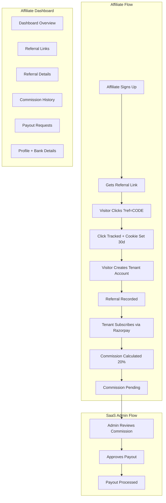
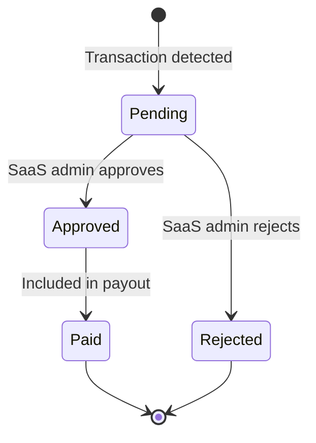

# Affiliate Partner Dashboard — Full Implementation Plan

**Overview:** Build a complete affiliate marketing system with partner dashboard, referral tracking, 20% commission on tenant subscriptions, payout management, and SaaS admin integration — including new database tables, routes, API endpoints, and UI components.

---

## Architecture Overview

The affiliate system introduces a new user role (`affiliate`) with its own dashboard at `/affiliate/*`, tracked referral links, automatic 20% commission calculation on tenant subscription payments, payout management, and full SaaS admin oversight.



---

## 1. Database Schema (New Migration)

**File:** `supabase/migrations/20260321150000_affiliate_system.sql`

### New Tables

**affiliate_partners** — Core affiliate accounts

| Column | Type | Notes |
|--------|------|-------|
| id | uuid PK | |
| user_id | uuid FK auth.users | Unique |
| full_name | text | |
| email | text | |
| phone | text | Nullable |
| referral_code | text UNIQUE | Auto-generated (e.g. `AFF-XXXX`) |
| commission_rate | numeric(5,2) | Default `20.00` |
| status | text | `pending`, `active`, `suspended` |
| payout_method | text | `bank_transfer`, `upi`, `paypal` |
| payout_details | jsonb | Bank name, account, IFSC, UPI ID, etc. |
| total_earnings | numeric(12,2) | Default 0 |
| pending_balance | numeric(12,2) | Default 0 |
| total_paid_out | numeric(12,2) | Default 0 |
| min_payout_threshold | numeric(12,2) | Default 500.00 |
| created_at | timestamptz | |
| updated_at | timestamptz | |

**affiliate_clicks** — Click tracking for analytics

| Column | Type | Notes |
|--------|------|-------|
| id | uuid PK | |
| affiliate_id | uuid FK affiliate_partners | |
| referral_code | text | |
| ip_address | inet | |
| user_agent | text | |
| landing_page | text | |
| created_at | timestamptz | |

**affiliate_referrals** — Referred tenants

| Column | Type | Notes |
|--------|------|-------|
| id | uuid PK | |
| affiliate_id | uuid FK affiliate_partners | |
| referred_tenant_id | uuid FK tenants | Nullable until conversion |
| referred_user_id | uuid FK auth.users | |
| referral_code_used | text | |
| status | text | `clicked`, `signed_up`, `subscribed`, `churned` |
| signed_up_at | timestamptz | |
| subscribed_at | timestamptz | |
| created_at | timestamptz | |

**affiliate_commissions** — Per-transaction commission records

| Column | Type | Notes |
|--------|------|-------|
| id | uuid PK | |
| affiliate_id | uuid FK affiliate_partners | |
| referral_id | uuid FK affiliate_referrals | |
| transaction_id | uuid FK transactions | |
| transaction_amount | numeric(12,2) | |
| commission_rate | numeric(5,2) | Snapshot of rate at time |
| commission_amount | numeric(12,2) | |
| status | text | `pending`, `approved`, `paid`, `rejected` |
| approved_at | timestamptz | |
| paid_at | timestamptz | |
| created_at | timestamptz | |

**affiliate_payouts** — Payout requests and history

| Column | Type | Notes |
|--------|------|-------|
| id | uuid PK | |
| affiliate_id | uuid FK affiliate_partners | |
| amount | numeric(12,2) | |
| payout_method | text | |
| payout_details | jsonb | Snapshot of bank details |
| payout_reference | text | UTR / transaction ref |
| status | text | `requested`, `processing`, `completed`, `failed` |
| requested_at | timestamptz | |
| processed_at | timestamptz | |
| notes | text | Admin notes |
| created_at | timestamptz | |

### RLS Policies

- Affiliates can only read/update their own records across all affiliate tables
- `super_admin` has full access to all affiliate tables
- `affiliate_clicks` insert allowed for `anon` (tracking pixel)
- Commission and payout writes restricted to `super_admin` + DB functions

### DB Functions

- `generate_referral_code()` — generates unique `AFF-XXXXXX` code
- `calculate_affiliate_commission(p_transaction_id uuid)` — trigger function that fires after INSERT on `transactions` when the tenant was referred; calculates 20% and inserts into `affiliate_commissions`
- `update_affiliate_balances()` — trigger after commission status changes to update `total_earnings`, `pending_balance`, `total_paid_out`

### Trigger

- `trg_affiliate_commission_on_transaction` — AFTER INSERT on `transactions` for subscription payments, checks if tenant has an affiliate referral, auto-creates commission record

---

## 2. Auth & Role Updates

### Add `affiliate` to `app_role` enum

```sql
ALTER TYPE public.app_role ADD VALUE IF NOT EXISTS 'affiliate';
```

### New Auth Hook

**File:** `src/hooks/useAffiliateAuth.ts`

Pattern follows existing [`src/hooks/useAdminAuth.ts`](../../src/hooks/useAdminAuth.ts) and [`src/hooks/useSaasAdminAuth.ts`](../../src/hooks/useSaasAdminAuth.ts):

- Check session via `supabase.auth.getSession()`
- Verify `has_role(user_id, 'affiliate')`
- Fetch affiliate profile from `affiliate_partners`
- Redirect to `/affiliate/login` if unauthorized

---

## 3. Route Structure

### Affiliate Dashboard Routes (`/affiliate/*`)

| Route | Component | Purpose |
|-------|-----------|---------|
| `/affiliate/login` | `AffiliateLogin` | Email/password login |
| `/affiliate/register` | `AffiliateRegister` | New affiliate signup |
| `/affiliate` | redirect | Redirect to `/affiliate/dashboard` |
| `/affiliate/dashboard` | `AffiliateDashboard` | Overview: earnings, clicks, conversions, charts |
| `/affiliate/links` | `AffiliateLinks` | Referral link generator + UTM builder + copy |
| `/affiliate/referrals` | `AffiliateReferrals` | List of all referred tenants with status |
| `/affiliate/commissions` | `AffiliateCommissions` | Commission history with filters |
| `/affiliate/payouts` | `AffiliatePayouts` | Payout history + request new payout |
| `/affiliate/profile` | `AffiliateProfile` | Edit profile, payout method, bank details |

**Layout:** `src/app/affiliate/(shell)/layout.tsx` — sidebar + header, same pattern as `src/app/admin/(shell)/layout.tsx`

### SaaS Admin Affiliate Management

| Route | Component | Purpose |
|-------|-----------|---------|
| `/saas-admin/affiliates` | `SaasAffiliateList` | All affiliates, approve/suspend |
| `/saas-admin/affiliates/payouts` | `SaasAffiliatePayouts` | Process payout requests |
| `/saas-admin/affiliates/settings` | `SaasAffiliateSettings` | Global commission rate, terms, min payout |

---

## 4. API Routes

| Route | Method | Purpose |
|-------|--------|---------|
| `/api/affiliate/register` | POST | Create affiliate account + user |
| `/api/affiliate/track` | GET | Track click, set `ref` cookie (30 days) |
| `/api/affiliate/stats` | GET | Dashboard stats for authenticated affiliate |
| `/api/affiliate/request-payout` | POST | Submit payout request |
| `/api/saas-admin/affiliates/[id]/approve` | POST | Approve/suspend affiliate |
| `/api/saas-admin/affiliates/payouts/[id]/process` | POST | Mark payout as completed/failed |
| `/api/saas-admin/affiliates/commissions/[id]/approve` | POST | Approve/reject pending commission |

---

## 5. Referral Tracking Flow (Detailed)

1. **Link Generation:** Affiliate gets link like `https://yourdomain.com/?ref=AFF-XXXXXX` or `https://yourdomain.com/create-account?ref=AFF-XXXXXX`
2. **Click Tracking:** `/api/affiliate/track?ref=AFF-XXXXXX&page=/` sets a 30-day cookie `aff_ref=AFF-XXXXXX` and inserts into `affiliate_clicks`
3. **Tenant Signup Integration:** Modify [`src/spa-pages/TenantSignup.tsx`](../../src/spa-pages/TenantSignup.tsx) and [`src/spa-pages/CreateTenantSignup.tsx`](../../src/spa-pages/CreateTenantSignup.tsx) to read the `aff_ref` cookie and pass it during account creation
4. **Referral Recording:** After successful tenant creation, insert into `affiliate_referrals` with status `signed_up`
5. **Subscription Conversion:** When tenant completes a subscription payment (via Razorpay), the DB trigger fires, checks `affiliate_referrals`, calculates 20% commission, inserts into `affiliate_commissions` with status `pending`
6. **Recurring Commissions:** The trigger fires on every subscription renewal transaction for the lifetime of the referral (or configurable duration)

---

## 6. Commission System

### Rate

- Default: **20% of subscription transaction amount**
- Configurable per-affiliate (stored in `affiliate_partners.commission_rate`)
- Global default configurable in `saas_platform_settings`

### Commission Lifecycle



### Auto-Approval Option

- SaaS admin can toggle auto-approve for commissions (skip manual review)
- Configurable in `saas_platform_settings`

---

## 7. Payout System

### Flow

1. Affiliate sees `pending_balance` on dashboard
2. Clicks "Request Payout" (must meet minimum threshold, default 500 INR)
3. Payout record created with status `requested`
4. SaaS admin sees request in `/saas-admin/affiliates/payouts`
5. Admin processes payment externally (bank transfer/UPI/PayPal)
6. Admin marks as `completed` with reference number, or `failed` with notes
7. `pending_balance` decremented, `total_paid_out` incremented

### Payout Methods

- **Bank Transfer** — Account number, IFSC, bank name, holder name
- **UPI** — UPI ID
- **PayPal** — PayPal email

---

## 8. UI Components (New Files)

### Affiliate Dashboard Components (`src/components/affiliate/`)

| Component | Purpose |
|-----------|---------|
| `AffiliateSidebar.tsx` | Navigation sidebar (same pattern as `AdminSidebar.tsx`) |
| `AffiliateLayout.tsx` | Shell layout with sidebar, header, auth guard |
| `AffiliateStatsCards.tsx` | KPI cards: total earnings, pending, clicks, conversions |
| `AffiliateEarningsChart.tsx` | Recharts line chart of monthly earnings |
| `AffiliateReferralTable.tsx` | Data table of referred tenants |
| `AffiliateCommissionTable.tsx` | Data table of commissions with status badges |
| `AffiliatePayoutTable.tsx` | Data table of payouts with status |
| `AffiliatePayoutRequestDialog.tsx` | Dialog to request payout with method selection |
| `AffiliateReferralLinkGenerator.tsx` | Link builder with UTM params + copy button |
| `AffiliateProfileForm.tsx` | Profile + payout details form |
| `AffiliateLoginForm.tsx` | Login form |
| `AffiliateRegisterForm.tsx` | Registration form |

### SaaS Admin Affiliate Components (`src/components/saas-admin/`)

| Component | Purpose |
|-----------|---------|
| `SaasAffiliateTable.tsx` | Affiliates list with approve/suspend actions |
| `SaasAffiliatePayoutTable.tsx` | Payout requests with process/reject actions |
| `SaasAffiliateSettingsForm.tsx` | Global commission settings |

---

## 9. Hooks (`src/hooks/`)

| Hook | Purpose |
|------|---------|
| `useAffiliateAuth.ts` | Auth guard + affiliate profile loading |
| `useAffiliateStats.ts` | Dashboard stats (TanStack Query) |
| `useAffiliateReferrals.ts` | Referral list with filters |
| `useAffiliateCommissions.ts` | Commission list with filters |
| `useAffiliatePayouts.ts` | Payout list + request mutation |
| `useAffiliateProfile.ts` | Profile CRUD |
| `useReferralTracking.ts` | Cookie read/write for `aff_ref` |

---

## 10. Integration Points (Existing Files to Modify)

| File | Change |
|------|--------|
| [`src/spa-pages/TenantSignup.tsx`](../../src/spa-pages/TenantSignup.tsx) | Read `aff_ref` cookie, pass to tenant creation |
| [`src/spa-pages/CreateTenantSignup.tsx`](../../src/spa-pages/CreateTenantSignup.tsx) | Read `aff_ref` cookie, pass to OAuth tenant creation |
| [`src/middleware.ts`](../../src/middleware.ts) / [`src/proxy.ts`](../../src/proxy.ts) | Add `/affiliate/*` routes + referral cookie tracking |
| [`src/integrations/supabase/types.ts`](../../src/integrations/supabase/types.ts) | Add affiliate table types |
| [`src/components/saas-admin/SaasAdminSidebar.tsx`](../../src/components/saas-admin/SaasAdminSidebar.tsx) | Add "Affiliates" section to sidebar |

---

## 11. File Structure Summary

```
src/
  app/
    affiliate/
      page.tsx                          # Redirect to /affiliate/dashboard
      login/page.tsx                    # Login
      register/page.tsx                 # Register
      (shell)/
        layout.tsx                      # Protected layout
        dashboard/page.tsx              # Dashboard
        links/page.tsx                  # Referral links
        referrals/page.tsx              # Referral details
        commissions/page.tsx            # Commissions
        payouts/page.tsx                # Payouts
        profile/page.tsx                # Profile
    saas-admin/(shell)/
      affiliates/page.tsx               # Affiliate management
      affiliates/payouts/page.tsx       # Payout management
      affiliates/settings/page.tsx      # Affiliate settings
    api/
      affiliate/
        register/route.ts
        track/route.ts
        stats/route.ts
        request-payout/route.ts
      saas-admin/
        affiliates/
          [id]/approve/route.ts
          payouts/[id]/process/route.ts
          commissions/[id]/approve/route.ts
  components/
    affiliate/
      AffiliateSidebar.tsx
      AffiliateLayout.tsx
      AffiliateStatsCards.tsx
      AffiliateEarningsChart.tsx
      AffiliateReferralTable.tsx
      AffiliateCommissionTable.tsx
      AffiliatePayoutTable.tsx
      AffiliatePayoutRequestDialog.tsx
      AffiliateReferralLinkGenerator.tsx
      AffiliateProfileForm.tsx
      AffiliateLoginForm.tsx
      AffiliateRegisterForm.tsx
    saas-admin/
      SaasAffiliateTable.tsx
      SaasAffiliatePayoutTable.tsx
      SaasAffiliateSettingsForm.tsx
  hooks/
    useAffiliateAuth.ts
    useAffiliateStats.ts
    useAffiliateReferrals.ts
    useAffiliateCommissions.ts
    useAffiliatePayouts.ts
    useAffiliateProfile.ts
    useReferralTracking.ts
  spa-pages/
    affiliate/
      AffiliateDashboard.tsx
      AffiliateLinks.tsx
      AffiliateReferrals.tsx
      AffiliateCommissions.tsx
      AffiliatePayouts.tsx
      AffiliateProfile.tsx
      AffiliateLogin.tsx
      AffiliateRegister.tsx
supabase/
  migrations/
    20260321150000_affiliate_system.sql
```

---

## Implementation checklist

- [ ] Create Supabase migration with 5 tables, RLS policies, triggers, and functions
- [ ] Update `src/integrations/supabase/types.ts` with affiliate table types
- [ ] Create `useAffiliateAuth.ts` hook
- [ ] Create affiliate route structure (login, register, dashboard, links, referrals, commissions, payouts, profile)
- [ ] Create `AffiliateLayout.tsx` and `AffiliateSidebar.tsx`
- [ ] Build affiliate dashboard components
- [ ] Create TanStack Query hooks
- [ ] Create affiliate spa-pages
- [ ] Create API routes (register, track, stats, request-payout)
- [ ] Implement referral tracking (cookie + TenantSignup / CreateTenantSignup)
- [ ] Add SaaS admin affiliate pages + sidebar
- [ ] Create SaaS admin API routes (approve affiliate, process payout, approve commission)
