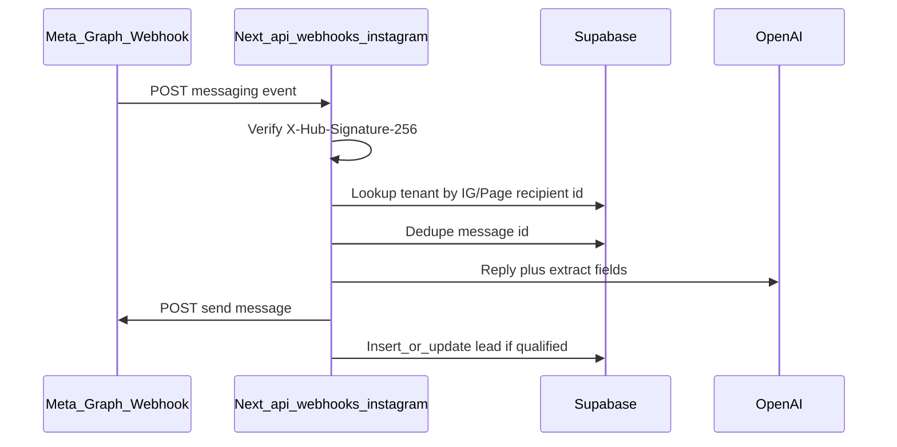

# Instagram DM AI lead bot (full integration)

**Overview:** **Instagram automation suite** (**paid** plugin `instagram_dm_leads`), **three phases**, each with **cross-check + automated tests** (see **Phase completion** / **Automated testing**). Scope: **DM / comment / story**, **keywords**, **conditions** (follower gate), **Posts/Reels**, **scheduling**, **analytics**, **real-time**. Pipeline: webhooks → entitlement → media match → keywords + conditions → AI/templates → `leads` / activity.

## Phased delivery (build plan)

Work is sequenced so **Phase 1** is shippable and testable end-to-end; later phases add breadth and advanced behavior.

### Phase 1 — Foundation + DM MVP (ship first)

**Goal:** Tenants can **buy the plugin**, **connect Instagram**, receive **DM webhooks**, get **AI replies + lead capture** into `leads`, with a **minimal admin** experience.

- **SaaS platform**: `saas_meta_platform_config` (or `saas_platform_settings` keys) + **`getMetaPlatformCredentials()`** + **SaaS Admin UI** for Meta App ID / secret / webhook verify token; server **DB → env fallback**.
- **Marketplace**: Register **`instagram_dm_leads`** in manifest + **paid catalog item**; **entitlement helper** (install + recurring `paid_until`).
- **Database (minimal)**: `tenant_instagram_connections`, **webhook dedupe** table, **`instagram_channel_activity`** (at least `channel: dm`), stub or minimal **`instagram_automation_config`**; RLS; **Realtime** on activity for Overview.
- **APIs**: `GET/POST /api/webhooks/instagram` — **messaging branch only** (DMs): signature verify, tenant resolution, dedupe, entitlement, **LLM + qualified leads** (`source: instagram_dm`); Meta OAuth **auth + callback** (tenant admin, gated).
- **Tenant admin UI**: **Instagram Bot** sidebar when entitled — **Overview**, **Setup** (connect/disconnect, webhook URL copy), **main dashboard** summary card; no full keyword/comment UI yet (or **read-only** placeholders).
- **Docs / env**: Update [`.env.local.example`](../.env.local.example); Meta app **messages** subscription only for Phase 1; short operator doc for webhook URL + verify token.

### Phase 2 — Automations, comments, Posts/Reels, scheduling, analytics

**Goal:** Full **Automations** surface: **keywords**, **schedule**, **Post & Reel targeting**, **comment** path on webhook, **media list API**, **multi-channel activity** + **Analytics** + **Realtime** dashboards.

- **Database**: Extend config with **`keyword_rules`**, **`schedule`**, **`instagram_automation_media_targets`**; optional **`instagram_automation_schedules`** / keyword table; activity rows for **`comment`** / **`story`** where implemented.
- **APIs**: Webhook **POST** handles **`changes`** (comments) + **media_id allowlist**; **`GET /api/integrations/instagram/media`** for picker; keyword evaluation + **template vs AI** branches; schedule guard.
- **Tenant admin UI**: **Automations** (Keywords, Schedule, **Posts & Reels** picker, DM/comment/story toggles), **Analytics** page (by channel, Realtime), expand **Overview** KPIs.
- **Meta**: Additional webhook fields / permissions for **comments**; App Review as needed.

### Phase 3 — Advanced conditions, follower gate, polish

**Goal:** **Production-hardening** and **advanced** automation: **follower check** before privileged links, **conditions** on rules, analytics for **follower-gated** funnels, optional **rollups** / rate tuning, **beta** flags for API-unstable features.

- **Graph**: `checkSenderFollowsBusinessAccount` + **caching**; **`require_follower`** on `send_link` rules; **`else_message`**; activity **`meta.follower_check`**.
- **UI**: **Conditions** tab / columns on rules; “advanced” badges; analytics: `link_sent_follower` vs `blocked_not_following`.
- **Optional**: `pg_cron` / Vercel Cron for scheduled campaigns; deeper **analytics rollups** if volume requires.
- **Quality**: Policy review, error handling, monitoring, documentation for operators.

### Phase completion: cross-check (manual / sign-off)

Before merging or releasing each phase, run a **short cross-check** so regressions do not carry forward.

- **Phase 1**
  - [ ] SaaS Meta credentials **save/load**; **env fallback** when DB empty; **secret never** in client bundles or logs.
  - [ ] **Webhook GET** challenge matches configured verify token; **POST** rejects bad `X-Hub-Signature-256`.
  - [ ] **Entitlement**: uninstalled tenant → no DM processing; installed → processes.
  - [ ] **OAuth** happy path + denied/error; tokens **encrypted** at rest.
  - [ ] **Lead** row created with `source: instagram_dm` on qualified path; RLS for tenant admin read.
  - [ ] **Realtime** (if enabled): tenant sees only own activity rows.
- **Phase 2**
  - [ ] **Comment** events ignored when `media_id` not in allowlist; allowed media runs keyword/schedule.
  - [ ] **Keyword** rule order and **template vs AI** branch; **schedule** blocks outside window.
  - [ ] **Media API** returns only for entitled tenant + valid connection.
  - [ ] **Analytics** counts align with `instagram_channel_activity` for a test window.
- **Phase 3**
  - [ ] **`require_follower`**: link withheld when check fails / unknown (per policy); **`else_message`** sent.
  - [ ] **Cache** invalidation / TTL sane for follower helper.
  - [ ] **Monitoring**: errors from Graph do not crash webhook; structured logs without secrets.

### Automated testing (required per phase)

Add and run tests in **CI** (e.g. GitHub Actions / existing pipeline) so each phase has a **regression suite** before release.

- **Pure functions**: Keyword match (`contains` / `whole_word` / `exact`), **schedule** evaluation (timezone + weekly windows + quiet hours), dedupe key extraction, optional **follower cache** key.
- **Crypto / config**: `getMetaPlatformCredentials()` resolution order (DB vs env mock); **signature verify** for webhook POST (golden vector with known secret).
- **API routes**: `GET /api/webhooks/instagram` challenge response; `POST` with **invalid signature** → 4xx; **mock** Meta Graph + OpenAI for DM path → assert outbound send + DB inserts (integration tests with test doubles).
- **Entitlement**: Mock Supabase: tenant without install → handler short-circuits; with install → continues.
- **Phase 2+**: Comment payload fixtures → **media allowlist** branch; keyword rule fixtures → expected action.
- **Phase 3**: Mock Graph **follower** API: follow / no-follow / error → expected message path and `meta.follower_check`.
- **E2E (optional)**: Playwright: tenant admin **Install** plugin (or seed) → **Setup** page visible; smoke **OAuth** redirect (mock callback in staging).

**Conventions**: Store **fixture JSON** for Meta webhook payloads in `__tests__/fixtures/` (or similar); keep tests **deterministic** (no live Meta calls in CI). Run the project test script on every PR touching Instagram routes.

### Database migrations (Supabase CLI) — each phase

Schema changes **ship with the phase** as versioned SQL in [`supabase/migrations/`](../supabase/migrations/) — **one migration file (or small set) per phase** with a clear timestamp prefix (e.g. `20260323120000_instagram_phase1_core.sql`). Do **not** hand-edit production without a migration file in Git.

- **Phase 1 migration**: `saas_meta_platform_config` (or keys) + `tenant_instagram_connections` + dedupe + minimal `instagram_channel_activity` / `instagram_automation_config` + RLS + Realtime publication.
- **Phase 2 migration**: extend config / `instagram_automation_media_targets` / schedules / keyword tables as designed; new RLS policies if needed.
- **Phase 3 migration**: any columns for `follower_check` metadata, caches, or rollups.

**CLI workflow (automate in scripts / CI where possible)**:

- **Local**: `supabase migration new <name>` → edit SQL → `supabase db push` or `supabase migration up` (after `supabase link` to project) so the DB updates **from the repo**.
- **Regenerate types** after each migration: e.g. `npx supabase gen types typescript --project-id <ref> > src/integrations/supabase/types.ts` (or your existing script); sync **`mobile/lib/database.types.ts`** if required by the project.
- **CI**: Add a job that **validates** migrations apply cleanly (e.g. `supabase db lint` / push to a **branch preview** database, or `supabase start` + `db reset` in Docker) so broken SQL is caught **before** merge.
- **Optional npm scripts** in [`package.json`](../package.json): e.g. `db:migrate`, `db:types` to standardize commands.

### Git workflow — each phase

- **Branch**: Use a dedicated branch per phase (e.g. `feature/instagram-automation-phase-1`) or **one PR per phase** so review, migrations, and app code land together.
- **Commits**: Keep migration files + TypeScript changes in the **same PR** as the feature; commit message references phase (e.g. `feat(instagram): phase 1 — DM webhook + migrations`).
- **Tag / release**: After a phase passes **cross-check + tests + CI**, merge to main and create a **Git tag** (e.g. `instagram-plugin-phase-1-complete` or bump **`package.json` / changelog** if the product uses semver for the app).
- **No drift**: The database state for deployed envs must always be **reproducible** from `supabase/migrations/` in Git — avoid one-off SQL on production without a matching migration file.

---

## Multi-channel automations and scheduling

- **Channels** (configure per tenant in **Automations**):
  - **DM automation** — inbound Instagram DMs → AI reply, qualification, `leads` (`source: "instagram_dm"`).
  - **Comment automation** — new comments on connected IG media (webhook `changes` / comment fields per [Meta Instagram Platform](https://developers.facebook.com/docs/instagram-platform)) → optional AI-generated **public reply** and/or **private reply** (where API allows), keyword filters, anti-spam; activity logged with `channel: "comment"`; leads optional with `source: "instagram_comment"` when contact is captured.
  - **Post & Reel targeting** — tenants **choose which content** automations apply to: **Feed posts** and/or **Reels** (media type from Graph: e.g. `media_product_type` / `media_type`). **Picker UX**: after OAuth, **list/sync** recent **Posts** and **Reels** via Instagram Graph API (`/{ig-user-id}/media` or equivalent); user **multi-selects** specific media IDs (or toggles **“all future posts / all future reels”** if product allows and policy permits). Webhook handler matches incoming `comment.media.id` (or equivalent) against **`instagram_automation_media_targets`** (or config jsonb) before running comment automation; unlisted media → no auto-action unless “global” mode is on.
  - **Story automation** — events such as **story replies** (often delivered via messaging) and **mentions** / relevant `instagram` webhook fields → auto-DM or templated follow-up per rules; `channel: "story"` in activity; align implementation with **current Meta docs** (fields and permissions vary; **App Review** may require extra scopes).
- **Scheduling** — not only 24/7 bots: tenants **set up and schedule** when each channel is active:
  - **Timezone** + **weekly windows** (e.g. Mon–Sat 9–21) and **quiet hours** (no auto-replies).
  - Optional **one-off or recurring schedule slots** (e.g. campaign windows) stored per tenant; evaluated in the webhook/cron path before sending.
  - Optional **Supabase `pg_cron` / Vercel Cron / Edge job** for time-based triggers (e.g. digest reminders) if product needs true clock-driven runs beyond “is now inside window?”
- **Config shape**: Extend **`instagram_automation_config.settings`** with `channels: { dm: {...}, comment: {...}, story: {...} }`, **`schedule`**, **`media_targets`**, and **`keyword_rules`** (see below). Prefer a dedicated **`instagram_automation_media_targets`** table (`tenant_id`, `ig_media_id`, `media_product_type`, `enabled`, `created_at`) for clean queries and Realtime, or embed arrays in jsonb for MVP.

## Keyword automation setup

Tenants configure **which words or phrases** drive behavior on each channel — separate from the global AI personality.

- **Use cases**: e.g. user DMs or comments **“price”**, **“book”**, **“package”** → send a **fixed template**, a **DM with a link**, escalate to **full AI qualification**, or **ignore** (blocklist).
- **Per channel**: Independent keyword lists for **DM**, **comment**, and **story** (where text is available), so comment auto-replies can differ from DM flows.
- **Rule shape** (stored in **`instagram_automation_config.settings.keyword_rules`** or table **`instagram_automation_keyword_rules`**): ordered rows with `tenant_id`, `channel` (`dm`|`comment`|`story`), **`match`** string or array, **`match_type`** (`contains` | `whole_word` | `exact`), **`case_sensitive`** bool, **`action`** (`ai_reply` | `template_reply` | `send_link` | `suppress` | `qualify_lead_only`), optional **`template_text`** / **`url`**, **`priority`** (first match wins or merge with global default).
- **Webhook evaluation order**: After **entitlement**, **schedule**, and (for comments) **media allowlist**, **normalize** inbound text → walk **keyword rules** in priority order → if a rule matches, run its **action**; else fall back to **default channel behavior** (e.g. full AI for DM).
- **Blocklist / moderation**: Optional **`blocked_keywords`** list to **skip** automation or flag only (reduces spam and policy risk).
- **UI**: **Automations** → **Keywords** tab (or sub-section per channel): add/edit/reorder rules, test helper (sample text → shows which rule fires), toggle **keyword automation** master switch.

## Conditional automation & follower check (advanced)

Tenants can attach **conditions** to keyword rules or channel defaults so actions run only when criteria are met.

- **Follower-only link (primary ask)**: For actions such as **`send_link`**, optional condition **`require_follower: true`** — **only send the URL if** the sender **follows** the tenant’s Instagram Business/Creator account; otherwise send a configurable **`else_message`** (e.g. “Follow @YourBrand and message again to get the link”) **without** the link.
- **Server check**: Implement **`checkSenderFollowsBusinessAccount`** (or equivalent) using the **Instagram Graph API** with the tenant’s **Page/long-lived token**, passing the **IG-scoped user id** from the webhook (`sender.id` / PSID mapping per Meta payload). **Exact endpoint and fields depend on current Meta docs** (e.g. user profile / relationship queries — permissions often need **Advanced Access** + **App Review**). If the API **cannot** determine follow status, policy: **fail closed** (do not send privileged link) and send `else_message`, or **log** `follower_check: unknown` in `instagram_channel_activity.meta` for analytics.
- **Caching**: Short TTL cache per `(tenant_id, sender_ig_id)` in memory or DB to avoid rate limits on repeated DMs.
- **Other conditions** (extensible): e.g. **`min_account_age_days`** (if ever exposed), **`first_message_only`** — store as jsonb on rules; evaluate in order: **schedule** → **media** → **keyword** → **conditions** → **action**.
- **Rule schema extension**: Add optional **`conditions`** on each keyword rule: `{ require_follower?: boolean, else_template?: string }` (and global defaults in `instagram_automation_config.settings.conditions_defaults`).
- **UI**: **Automations** → **Conditions** sub-tab or column on keyword rows: toggle **“Followers only (for links)”**, edit **fallback message**, show **advanced** badge + link to Meta permission requirements.
- **Analytics**: Funnel events: `link_sent_follower`, `link_blocked_not_following`, `follower_check_failed`.

## Marketplace: paid plugin

- **Product shape**: A **`marketplace_items`** row with `type: "plugin"`, **`pricing_model`**: `one_time` or **`recurring`** (monthly/yearly), `price` > 0, and a validated manifest: `{ "plugin_key": "instagram_dm_leads", "settings": {}, "doc_url": "..." }` (minimal settings; OAuth + DB hold real config).
- **Code registration**: Add `instagram_dm_leads` to [`REGISTERED_PLUGIN_KEYS`](../src/lib/marketplace-manifest.ts) and extend [`pluginManifestSchema`](../src/lib/marketplace-manifest.ts) (plus [`defaultPluginSettings`](../src/lib/marketplace-manifest.ts), [`MarketplacePluginBuilderPanel`](../src/components/saas-admin/MarketplacePluginBuilderPanel.tsx), and the AI-suggest system string in [`src/app/api/saas-admin/marketplace/ai-suggest/route.ts`](../src/app/api/saas-admin/marketplace/ai-suggest/route.ts)) so SaaS Admin can publish the item.
- **Tenant purchase**: Same as today — browse [`AdminMarketplace`](../src/spa-pages/admin/AdminMarketplace.tsx), **Pay & install** for paid items; [`verify-payment`](../src/app/api/marketplace/verify-payment/route.ts) records the transaction and upserts [`tenant_marketplace_installs`](../src/integrations/supabase/types.ts) with `status: "installed"` (and `config.marketplace.paid_until` for recurring).
- **Entitlement gating**: Before starting OAuth, processing the callback, or handling DM traffic for a tenant, verify an install exists for the catalog item whose manifest uses `plugin_key === "instagram_dm_leads"`, `status === "installed"`, and (if recurring) `paid_until` is still in the future. Reject or no-op with a clear error if the subscription expired or the plugin was disabled.
- **Super admin**: Create/publish the paid listing (name, description, preview image, sort order) in SaaS Admin Marketplace; optional SQL seed for demo tenants.

## Platform (SaaS Admin): Facebook / Instagram API configuration

One **Meta (Facebook) app** powers webhooks and OAuth for **all tenants**; **platform-level credentials** are managed by **super admin**, not by each tenant.

- **UI**: Add a **Facebook / Instagram API** (or **Meta integrations**) section in [`SaasAdminSettings.tsx`](../src/spa-pages/saas-admin/SaasAdminSettings.tsx) or a dedicated route e.g. [`/saas-admin/settings`](../src/app/saas-admin/(shell)/settings/page.tsx) tab / [`/saas-admin/integrations/meta`](../src/app/saas-admin/(shell)/) — fields:
  - **Meta App ID** (`meta_app_id`)
  - **Meta App Secret** — **masked** in UI after save; rotate supported
  - **Webhook verify token** (`meta_webhook_verify_token`) — must match Meta dashboard subscription
  - **Instagram / Graph API version** (optional string, e.g. `v25.0`) for outbound calls
  - **OAuth redirect URL** base or full path (or derive from existing platform base domain settings in [`saas_platform_settings`](../src/integrations/supabase/types.ts))
  - Short **docs link** / inline help for Meta Developer Console steps
- **Who can edit**: **`super_admin` only** (same pattern as other sensitive SaaS settings). Tenant admins never see app secret.
- **Database** — extend existing key-value store **[`saas_platform_settings`](../src/integrations/supabase/types.ts)** (`setting_key` / `setting_value`) with new keys, **or** add a migration **`saas_meta_platform_config`** (single row) with columns: `meta_app_id`, `app_secret_ciphertext` (encrypted blob or use **Supabase Vault** / app-layer AES with `META_CREDENTIALS_ENCRYPTION_KEY`), `webhook_verify_token`, `graph_api_version`, `oauth_redirect_uri`, `updated_at`. Prefer **encryption for `app_secret`**; never store plaintext in a client-readable column.
- **Server resolution order**: API routes (`/api/webhooks/instagram`, OAuth) load credentials with **`createServiceRoleClient`** (or secure server helper): **DB platform config first**, then **fallback to environment** (`META_APP_ID`, `META_APP_SECRET`, `META_WEBHOOK_VERIFY_TOKEN`) so local dev and migrations keep working.
- **RLS / policies**: Ensure only service role or locked-down RPC can read secrets; SaaS Admin UI saves via **server API route** that validates `super_admin`, not direct client write of secrets to a public table.

## Per-tenant Instagram connection

- **Each tenant connects their own Instagram** (Business/Creator account linked to their Facebook Page). There is no shared “app Instagram” for messaging—credentials are stored per `tenant_id`.
- The tenant **admin** uses **Connect with Facebook** in that tenant’s dashboard; OAuth completes for **that tenant only** and saves their Page access token + Instagram Business Account ID.
- The **webhook URL is shared** across all tenants (one Meta app callback), but every incoming DM is routed by **recipient Instagram business id** to the correct tenant row.
- **Disconnect** removes only that tenant’s tokens; other tenants stay connected.

## Implementation checklist (by phase)

**Phase 1**

- [ ] **DB**: **`saas_meta_platform_config`** (or keys); `tenant_instagram_connections`, dedupe, minimal `instagram_channel_activity` + `instagram_automation_config` stub; RLS; Realtime; types
- [ ] **`getMetaPlatformCredentials()`** + SaaS Admin Meta credentials UI + **super_admin** API
- [ ] **Marketplace** plugin **`instagram_dm_leads`** + paid item + **entitlement helper**
- [ ] **Webhook** GET/POST (**DM/messaging only**) + OAuth routes + encrypted tenant tokens
- [ ] **LLM** path + **`leads`** (`instagram_dm`)
- [ ] **Admin**: Instagram Bot **Overview** + **Setup** + dashboard card (entitled only)

**Phase 2**

- [ ] **DB**: keyword/schedule/media_targets tables or jsonb; full **`instagram_channel_activity`**
- [ ] **Webhook**: **comment** branch + **media allowlist** + **keyword** + **schedule**
- [ ] **`GET .../instagram/media`** + Automations UI (Keywords, Schedule, Posts/Reels)
- [ ] **Analytics** page + Realtime

**Phase 3**

- [ ] **Follower check** helper + cache + **`require_follower`** + Conditions UI + analytics events
- [ ] **Polish**: monitoring, rollups optional, docs, App Review follow-ups

**Each phase — QA**

- [ ] Complete **cross-check** list for that phase (see **Phase completion: cross-check** above)
- [ ] Add/update **automated tests** for that phase; **CI green** before release
- [ ] **Supabase**: new migration file(s) under `supabase/migrations/`; **`supabase db push`** / migration applied to target env; **regenerate** `types.ts` (and mobile types if applicable)
- [ ] **Git**: PR merged with migrations + code; **tag** or release note for phase completion; no orphan DB changes

## Context

- **Existing pieces to reuse**: [`src/integrations/supabase/service-role.ts`](../src/integrations/supabase/service-role.ts) for server-side DB; [`leads`](../src/integrations/supabase/types.ts) table (`source`, `meta` JSON, `full_name`, `phone`, `message`); tenant [`ai_settings`](../src/integrations/supabase/types.ts) (`system_prompt`, `ai_model`, toggles) for personality-aligned replies.
- **Gaps**: No Meta/Instagram webhook, no OAuth for Page tokens, no DM send path. AI today is partly Edge (`ai-search` invoke from [`StickyBottomNav.tsx`](../src/components/StickyBottomNav.tsx)) — the DM bot should use a **dedicated Next.js API route** with `OPENAI_API_KEY` (or your existing OpenAI pattern from [`src/app/api/saas-admin/marketplace/ai-suggest/route.ts`](../src/app/api/saas-admin/marketplace/ai-suggest/route.ts)) so webhook handling stays in-repo and testable.

## Architecture (high level)

## 1. Meta Developer / product setup (manual, documented)

- Create a **Meta app** with **Instagram** product: **Messaging**, and fields needed for **comments** / **story-related** events per current [Instagram Platform](https://developers.facebook.com/docs/instagram-platform) webhook reference (exact field names change — **re-subscribe** when adding comment/story features).
- Configure **Webhook** URL: `https://<your-domain>/api/webhooks/instagram` (single callback for all tenants).
- Subscribe at minimum to **`messages`** for DMs; add **`instagram`** / `feed` / comment-related subscriptions as required for **comment automation**; story interactions often overlap with **messaging** (story reply) — confirm in docs for your app type.
- Request permissions for messaging, **instagram_manage_comments** (or successors), `pages_manage_metadata`, etc. — plan for **Advanced Access** / **App Review**; **automation must comply** with Meta’s automation and messaging policies.
- Document in a short ops file (only if you want it in-repo): App ID, redirect URIs, required permissions, and that **Instagram account must be Business/Creator** and **linked to a Facebook Page**.

## 2. Database (new migration)

Add tables (names illustrative; keep consistent with your naming):

- **`tenant_instagram_connections`**: `tenant_id` (PK/FK), `facebook_page_id`, `instagram_business_account_id` (recipient id used in webhooks), encrypted or server-only `page_access_token`, `token_expires_at`, `created_at`, `updated_at`. RLS: tenant read via membership; **writes from webhook use service role only**.
- **`instagram_webhook_events`** (or similar): `message_mid` (unique) for **idempotency** so Meta retries do not double-reply or duplicate leads.
- **`instagram_channel_activity`**: append-only — `tenant_id`, **`channel`** (`dm` | `comment` | `story`), `event_type`, timestamps, `latency_ms`, `lead_id` nullable, `meta` jsonb (media_id, comment_id, **`inbound_text`** for DM admin preview, etc.) — **analytics + Realtime** for all channels.
- **`instagram_automation_config`**: `tenant_id` PK, `settings` jsonb — per-channel automation, **`keyword_rules`** (and optional **`blocked_keywords`**), merged prompts; **schedule** block or FK to schedules table.
- Optional **`instagram_automation_keyword_rules`** table — if not embedded in jsonb: `tenant_id`, `channel`, `match`, `match_type`, `action`, `template_text`, `url`, `priority`, `enabled`.
- **`instagram_automation_schedules`** (optional if not embedded): `tenant_id`, `timezone`, `weekly_rules` jsonb, `quiet_hours`, optional `campaigns` (start/end ISO) for **scheduled** automation windows.
- **`instagram_automation_media_targets`**: `tenant_id`, `ig_media_id`, **`media_product_type`** (e.g. `FEED` / `REELS` per Graph), optional caption snapshot, `enabled` — which **Posts** and **Reels** run **comment** (and related) automations; supports user **selection** from synced catalog.
- Optional: **`instagram_dm_sessions`** for conversation memory (last N turns per sender).

Regenerate types: [`src/integrations/supabase/types.ts`](../src/integrations/supabase/types.ts) and [`mobile/lib/database.types.ts`](../mobile/lib/database.types.ts) after migration.

## 3. Next.js API routes (server-only)

| Route | Role |
| ----- | ---- |
| `GET /api/webhooks/instagram` | Meta **subscription verification** (`hub.mode`, `hub.verify_token`, `hub.challenge`). Compare `verify_token` to `META_WEBHOOK_VERIFY_TOKEN` (global) or a value stored per tenant if you prefer. |
| `POST /api/webhooks/instagram` | Verify signature; handle **messaging** (DMs / story replies in messaging) and **changes** (e.g. **comments**) per payload shape; resolve tenant → **entitlement** → **evaluate schedule** (skip if outside window / quiet hours) → dedupe per event type → load config + `ai_settings` → channel-specific LLM or Graph **comment reply** API → `leads` + **`instagram_channel_activity`**. |
| `GET /api/integrations/instagram/auth` | Start OAuth (tenant admin session): **403 if plugin not purchased/active**; redirect to Meta OAuth with `state` tying to `tenant_id` (signed or server-stored nonce). |
| `GET /api/integrations/instagram/callback` | Same entitlement check; exchange code for tokens; fetch Page + connected Instagram business account ids; store long-lived page token + ids in `tenant_instagram_connections`. |
| `GET /api/integrations/instagram/media` (example) | **Tenant admin** + entitlement: return recent **Posts** and **Reels** for the connected IG user (Graph `/{ig-user-id}/media` with fields needed for picker); used to populate **select post / select reel** UI. |

**Sending DMs**: Use Graph API `POST /{page-id}/messages` with the stored page access token (see current Meta “Instagram Messaging API” docs for exact path/version).

**Secrets**: Prefer encrypting `page_access_token` at rest (e.g. libsodium/`crypto` with a server env `INSTAGRAM_TOKEN_ENCRYPTION_KEY`) — do not store plaintext tokens in client-readable columns.

## 4. AI behavior

- **System prompt**: Merge `ai_settings.system_prompt` with **`instagram_automation_config.settings`** per **`channel`**. If **keyword rule** matched with `action: ai_reply` or default AI path, use merged prompts; if **`template_reply`**, skip LLM for that turn (or use LLM only to personalize a template — product choice). Respect **master toggle**, **per-channel toggles**, **schedule**, and **blocklist** (no auto-reply if blocked).
- **Model**: Start with `gpt-4o-mini` or align with `ai_settings.ai_model` if it is OpenAI-compatible; if `ai_settings` uses non-OpenAI model IDs (e.g. `google/...`), either map to OpenAI for this path only or add a small adapter — **simplest path**: dedicated env `INSTAGRAM_DM_MODEL` defaulting to a known OpenAI model.
- **Output**: Channel-specific: DMs use qualification JSON + `source: "instagram_dm"`; comments/stories map to `source: "instagram_comment"` / `"instagram_story"` when a lead is captured, with `meta` including ids for the originating media/comment/story.

## 5. Admin UI, menu, dashboards, automations, and real-time analytics

- **Discovery**: Tenants install/pay from [`AdminMarketplace`](../src/spa-pages/admin/AdminMarketplace.tsx) like any other paid plugin.
- **After install — sidebar**: Collapsible **“Instagram Bot”** in [`AdminSidebar.tsx`](../src/components/admin/AdminSidebar.tsx), **only when** entitled:
  - **Overview** → `/admin/instagram-bot` — live **status + KPI strip** (connection, token, webhook, volume **by channel**); **Live DM preview** (DM-only chat bubbles) via **Realtime** on `instagram_channel_activity`. For each processed DM, the webhook stores **`meta.inbound_text`** (truncated user message) on the activity row so admins see inbound copy; the row is written **after** handling (reply/suppress/etc.), not at the instant Meta delivers the webhook.
  - **Automations** → `/admin/instagram-bot/automations` — **Keywords** (rules, blocklist, match settings); **DM / Comment / Story**; **Posts & Reels**; **Schedule**; Realtime on updates.
  - **Analytics** → `/admin/instagram-bot/analytics` — funnels and time series **by channel** (DM vs comment vs story); same Realtime pattern on `instagram_channel_activity`.
  - **Connection** (or **Setup**) → `/admin/instagram-bot/setup` — OAuth **Connect / Disconnect**, copy **shared** webhook URL, Meta docs — connection health **live** via Realtime on `tenant_instagram_connections` updates.
- **Main dashboard**: [`AdminDashboard.tsx`](../src/spa-pages/admin/AdminDashboard.tsx) — compact **real-time** Instagram card(s): same top KPIs as Overview (counts refresh on Realtime events).
- **Routing**: `instagram-bot/page.tsx`, `automations/page.tsx`, `analytics/page.tsx`, `setup/page.tsx` under `src/app/admin/(shell)/`; [`AdminLayout.tsx`](../src/components/admin/AdminLayout.tsx) titles.
- **Real-time architecture (required)**:
  - Use **Supabase Realtime** `postgres_changes` (or broadcast) on tables scoped by `tenant_id` under RLS.
  - Webhook handler **inserts** into `instagram_channel_activity` for every significant step (all channels).
  - For expensive aggregates at scale, add nightly/hourly rollups later; **MVP** can compute charts client-side from Realtime-fed recent data + initial `select` for range.
- Only **that tenant’s** admins may access (same auth as other admin pages).

## 6. Environment variables

- `META_APP_ID`, `META_APP_SECRET`, `META_WEBHOOK_VERIFY_TOKEN` — **optional if set in SaaS Admin DB**; still recommended for local dev
- `META_CREDENTIALS_ENCRYPTION_KEY` (or Vault) — if encrypting app secret in DB
- `INSTAGRAM_OAUTH_REDIRECT_URI` (must match Meta app settings)
- `OPENAI_API_KEY` (or reuse existing) + optional `INSTAGRAM_DM_MODEL`
- `INSTAGRAM_TOKEN_ENCRYPTION_KEY` (if encrypting tokens)
- Existing `SUPABASE_SERVICE_ROLE_KEY` + Supabase URL for webhook DB access

## 7. Testing and rollout

- Use **Meta’s test users / development mode** and [webhook test tool](https://developers.facebook.com/) before production.
- Log structured errors (signature fail, unknown recipient, send API errors) without leaking tokens.
- Rate-limit LLM + outbound sends per tenant if needed (reuse [`src/lib/rate-limit-memory.ts`](../src/lib/rate-limit-memory.ts) pattern).
- **Realtime QA**: Verify Supabase Realtime subscriptions receive inserts only for the signed-in tenant’s `tenant_id` (RLS); load-test chart updates when many DMs arrive.

**Live DM preview empty after sending a test message**

- Meta must **POST** to your **deployed** webhook URL (HTTPS). Local `npm run dev` does not receive Meta traffic unless you use a tunnel and register that URL in the Meta app.
- The preview only shows rows **after** the webhook finishes handling the DM (it reads `instagram_channel_activity`). If nothing is inserted, check **host logs** (e.g. Vercel) for warnings prefixed with **`[instagram-webhook]`**: no matching `tenant_instagram_connections` for `recipient.id`, **entitlement** (plugin not installed / expired), **duplicate** `message_mid`, **automation master** disabled, or **DM channel** disabled in `instagram_automation_config.settings`.
- Confirm the Instagram **Instagram Business Account id** (or Page id) Meta sends as **recipient** matches the row stored at OAuth time.
- **Graph Send API host**: **Instagram Login** (OAuth on instagram.com) stores an Instagram user token — outbound replies use **`graph.instagram.com/{version}/me/messages`**; **Facebook Login + Page** uses **`graph.facebook.com`**. The handler picks the host from `tenant_instagram_connections` and retries once on token/host mismatch (same idea as the media API).
- **Inbound shape**: Meta can send **text**, **attachments only** (image/sticker/reel — no `message.text`), or events under **`entry.standby`** (handover). The webhook now treats attachment-only DMs and merges **`messaging` + `standby`** so those still create activity rows when eligible.

## Risk / scope notes

- **App Review** is required for broad customer use of Instagram messaging permissions; development can proceed on a test IG account.
- **Webhook URL must be HTTPS** on a public host (ngrok for local dev).
- Multi-tenant **one webhook URL** is standard: tenant resolution is always by **recipient Instagram business id** stored at OAuth time.
- **Deep analytics at scale**: High volume may require rollups; MVP: Realtime + `instagram_channel_activity` queries.
- **Comment/story APIs**: Meta permissions and webhook payloads evolve; some automations may ship **after** DM MVP — plan phases (DM first, then comments, then story-specific events) if review timelines bite.
- **Follower check**: Meta may not expose a reliable “follows me” flag for every messaging identity; **feature-flag** or label **Beta** until verified against live API; comply with Meta policies (no deceptive follow gating).
