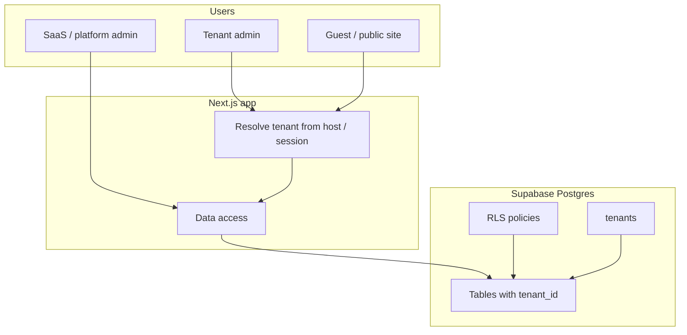

# Multi-tenancy architecture

This project uses **Next.js** with **Supabase (Postgres)**. Multi-tenancy here means **one deployed app serves many customers (“tenants”)**, with separation enforced by **`tenant_id`**, **application queries**, and **Row Level Security (RLS)** where configured.

---

## 1. Common models

| Model | Idea | Pros | Cons |
|--------|------|------|------|
| **Shared database, shared schema** | One DB; tenant-owned rows carry a **`tenant_id`**. | Simple ops, one backup, cost-effective. | Must get RLS + app filtering right. |
| **Schema per tenant** | One DB; each tenant gets a Postgres **schema**. | Stronger isolation than a single column. | Migrations across many schemas; more ops work. |
| **Database per tenant** | Separate DB per tenant. | Maximum isolation. | Higher cost and operational complexity. |

This codebase follows the **shared database + shared schema + `tenant_id`** pattern.

---

## 2. How this app maps to that model

- **`public.tenants`** — one row per property/business account.
- **Child data** (stays, rooms, bookings, subscriptions, domains, menu items, etc.) uses **`tenant_id`** so each row belongs to exactly one tenant.
- **`get_my_tenant_id()`** (Supabase RPC) resolves the **current user’s tenant** for admin flows; queries use `.eq("tenant_id", …)` alongside it.
- **SaaS admin** (`/saas-admin/...`) is intended to **see all tenants** for platform management — that is separate from tenant-scoped admin.

---

## 3. Logical architecture

---

## 4. Defense in depth

1. **Application layer** — Queries that must be private to a tenant include the correct scope (e.g. `.eq("tenant_id", tenantId)`). Helpers like **`get_my_tenant_id()`** avoid duplicating “who is my tenant?” logic.

2. **Database layer (RLS)** — Where enabled, policies such as `tenant_id = public.get_my_tenant_id()` limit what authenticated users can read or write, even if a client mis-specifies filters.

3. **Auth & roles** — Supabase Auth identifies users; **`tenants`** (and related tables) link users to tenants. Roles such as **`admin`** vs platform **`super_admin`** control which UI and data paths are allowed.

4. **Service role** — **`SUPABASE_SERVICE_ROLE_KEY`** bypasses RLS and must stay **server-only**, never exposed to the browser.

---

## 5. Operational concerns

- **Public / marketing site** — Tenant resolution often uses **subdomain or custom domain** → lookup (e.g. **`tenant_domains`**) → **`tenant_id`** for that site’s content.
- **Performance** — Index **`tenant_id`** on high-volume tenant-scoped tables to avoid full-table scans.
- **Billing & limits** — Usage and plans are typically scoped per **`tenant_id`** (e.g. **`tenant_usage`**, **`subscriptions`**).

---

## 6. One-line summary

**Multi-tenancy in this stack is: one app, one database, many tenants, separated by `tenant_id` and enforced by careful queries plus RLS where policies exist.**

---

## Related files (examples)

- Tenant listing / platform: `src/spa-pages/saas-admin/SaasAdminTenants.tsx`
- Tenant-scoped admin queries: `get_my_tenant_id` usage under `src/spa-pages/admin/` and `src/components/admin/`
- Domain RLS notes: `src/spa-pages/admin/AdminAccountDomain.tsx`
